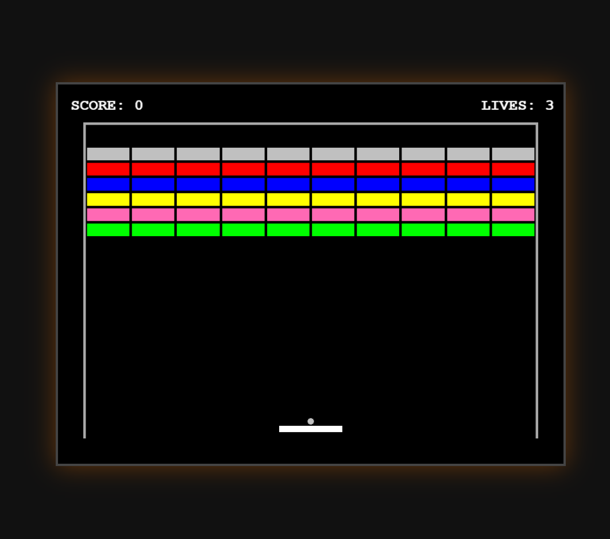
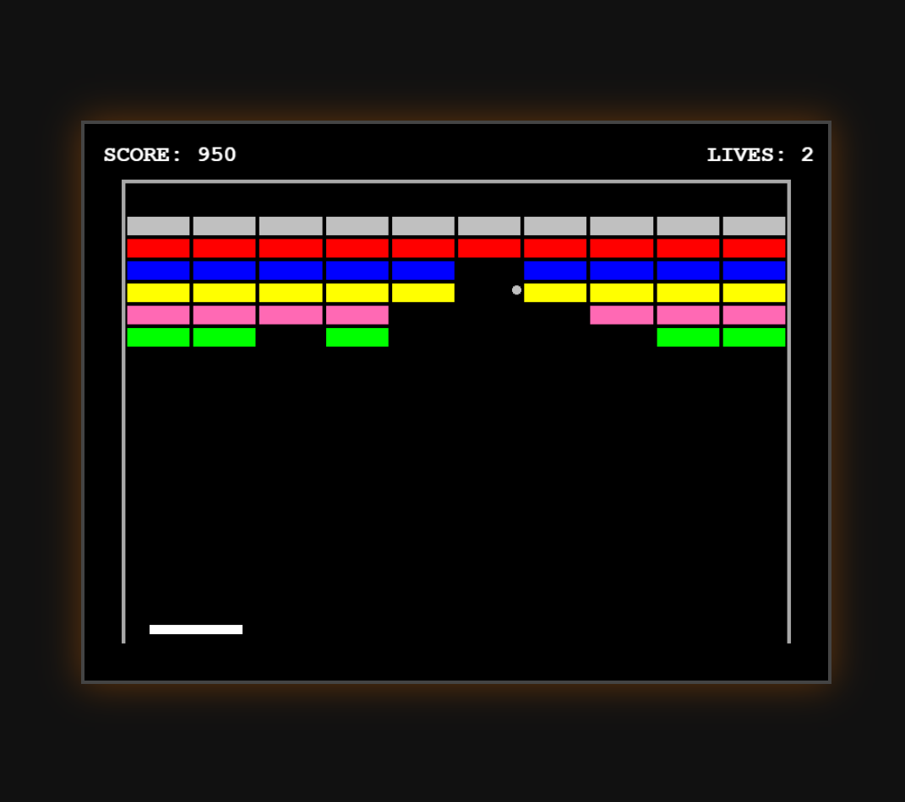
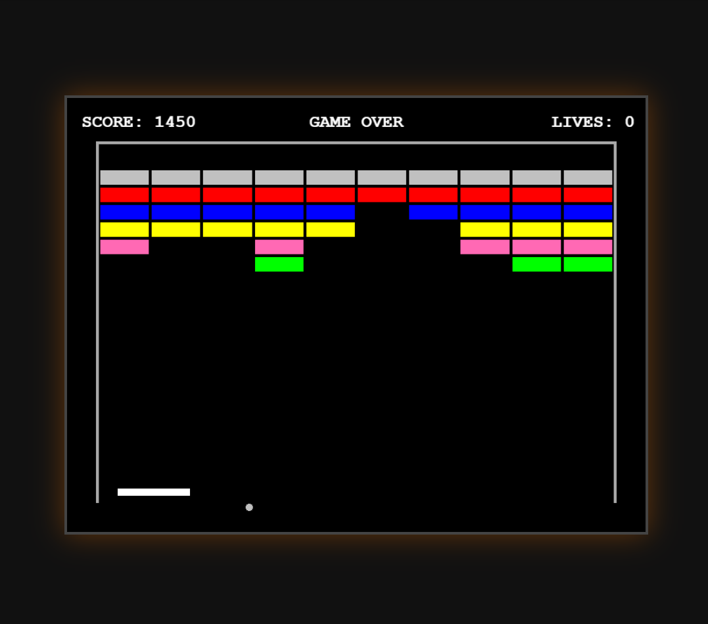

# Arkanoid

Классический арканоид, реализованный на HTML5, CSS3 и JavaScript с использованием библиотеки PixiJS.

Игра воспроизводит основные механики оригинала (Famicom, 1986):
- Управление ракеткой с клавиатуры
- Отскок мяча от стен, потолка, ракетки и блоков
- Угол отскока зависит от точки попадания на ракетке
- Блоки разных типов (обычные и серебряные, требующие нескольких ударов)
- Система очков, жизней и Game Over с рестартом

## Скриншоты

### Начало игры


### Игровой процесс


### Game Over


## Управление

- **<-** / **->** - Движение ракетки влево / вправо
- **Пробел** - Запуск мяча
- **Enter** - Рестарт после GameOver

## Как запустить

Игра работает в браузере. Никаких сборщиков и установок не требуется.

1. Склонируйте репозиторий:
```bash
   git clone https://github.com/kratnov638-cell/Arkanoid.git
```

2. Откройте проект через локальный HTTP-сервер (важно — не через `file://`, иначе браузер заблокирует загрузку ресурсов):
   - **XAMPP:** проект в `htdocs` → `http://localhost/arkanoid/`

3. Нажмите **Пробел**, чтобы запустить мяч.

## Технологии

- HTML5
- CSS3
- JavaScript (ES6+)
- PixiJS 8 — рендеринг и игровой цикл

## Структура проекта

```
arkanoid/
├── index.html            # Точка входа
├── css/
│   └── style.css         # Оформление страницы
├── js/
│   ├── game.js           # Класс ArkanoidGame — вся игровая логика
│   └── main.js           # Запуск игры
├── screenshots/          # Скриншоты
└── README.md
```

## Отчёт по времени

- Изучение PixiJS и разбор референса - 5 часов
- Реализация игры - 8 часов
- **Итого** **13 часов**

## Контакты

- **Автор:** Кратнов Матвей
- **GitHub:** https://github.com/kratnov638-cell
- **Резюме HH:** https://yaroslavl.hh.ru/resume/27f9dc77ff112979a00039ed1f6c4275537845
- **Email:** kratnovmatvei@gmail.com
